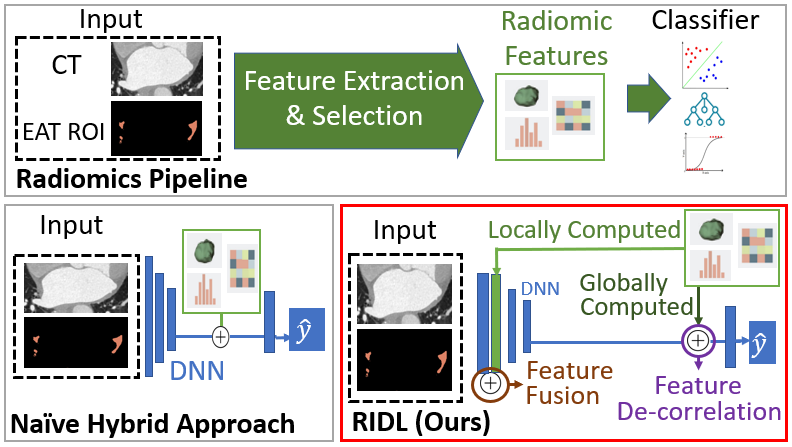

# Radiomics-Informed Deep Learning for Classification of Atrial Fibrillation Sub-Types from Left-Atrium CT Volumes


This is the implementation of UCVME for the paper ["Radiomics-Informed Deep Learning for Classification of Atrial Fibrillation Sub-Types from Left-Atrium CT Volumes"]().



<br />
<br />

## Data

We are working to make the dataset available publicly. We provide reference implementation code for the moment. 


<br />
<br />


## Training and testing


### To generate global and local radiomic features, run:

```
python3 gen_radiomic_global.py
python3 gen_radiomic_local_stp1.py
python3 gen_radiomic_local_stp2.py
```


### To perform feature selection, run :
``` 
python3 pyft_LASSO_A.py --alpha_param=0.12

```

### To generate a pre-trained DNN model for use, run:

```
bash script_pretrain.sh
```


### To perform training for RIDL, run:

```
bash script_ridl.sh
```

### To perform training for hybrid baseline, run:

```
bash script_hybrid.sh
```


<br />
<br />


## Notes
* Contact: DAI Weihang (wdai03@gmail.com)
<br />
<br />

## Citation
If this code is useful for your research, please consider citing:

(to be released)